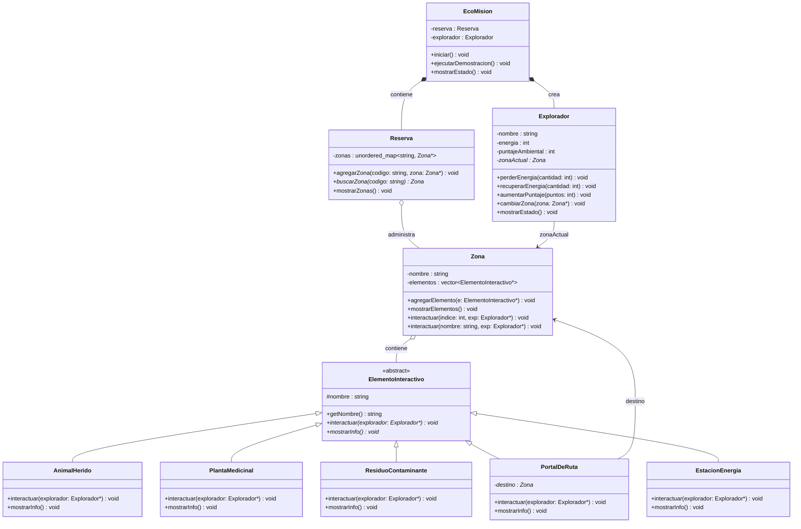
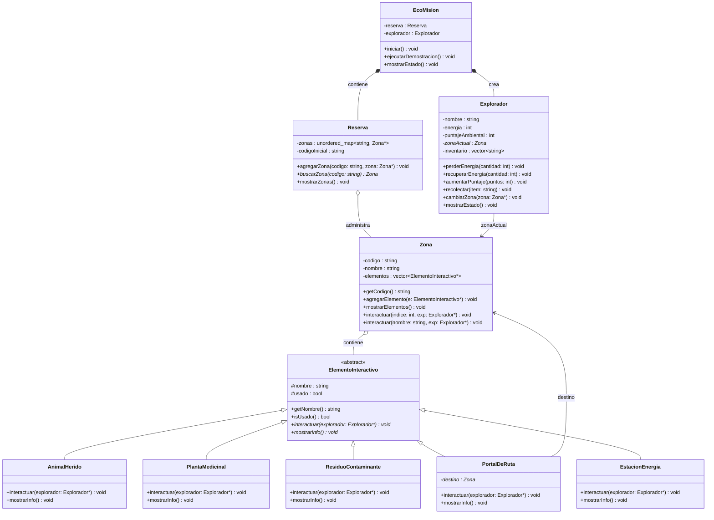

# Diseño del sistema — EcoMisión

## Versión inicial
> Diagrama elaborado antes de comenzar a programar. Se identificaron las clases principales y sus relaciones. Las subclases no tienen atributos propios definidos aún y algunas clases carecen de atributos que solo se descubrieron al codificar.

---

## Versión ajustada
> Diagrama actualizado al comenzar a programar. Se descubrió que `Zona` necesitaba su propio atributo `codigo` para poder mostrarlo en consola y para que `PortalDeRuta` funcionara correctamente. Se agregó `inventario` y `recolectar()` a `Explorador` al implementar `PlantaMedicinal`. Se centralizó el estado `usado` en la clase base `ElementoInteractivo` para no repetirlo en cada subclase. Se agregó `codigoInicial` a `Reserva` para saber dónde ubicar al explorador al iniciar.

---

## Versión final
> Diagrama al terminar el proyecto. Respecto a la versión ajustada, el único cambio fue definir los atributos propios de cada subclase, que solo se conocieron con certeza al implementar el método `interactuar()` de cada una. La estructura general de clases y relaciones se mantuvo igual desde la versión ajustada.

```mermaid
classDiagram
  class EcoMision {
    -reserva : Reserva
    -explorador : Explorador
    +iniciar() void
    +ejecutarDemostracion() void
    +mostrarEstado() void
  }
  class Reserva {
    -zonas : unordered_map~string, Zona*~
    -codigoInicial : string
    +agregarZona(codigo: string, zona: Zona*) void
    +buscarZona(codigo: string) Zona*
    +mostrarZonas() void
  }
  class Zona {
    -codigo : string
    -nombre : string
    -elementos : vector~ElementoInteractivo*~
    +getCodigo() string
    +agregarElemento(e: ElementoInteractivo*) void
    +mostrarElementos() void
    +interactuar(indice: int, exp: Explorador*) void
    +interactuar(nombre: string, exp: Explorador*) void
  }
  class Explorador {
    -nombre : string
    -energia : int
    -puntajeAmbiental : int
    -zonaActual : Zona*
    -inventario : vector~string~
    +perderEnergia(cantidad: int) void
    +recuperarEnergia(cantidad: int) void
    +aumentarPuntaje(puntos: int) void
    +recolectar(item: string) void
    +cambiarZona(zona: Zona*) void
    +mostrarEstado() void
  }
  class ElementoInteractivo {
    <<abstract>>
    #nombre : string
    #usado : bool
    +getNombre() string
    +isUsado() bool
    +interactuar(explorador: Explorador*)* void
    +mostrarInfo()* void
  }
  class AnimalHerido {
    -especie : string
    -curado : bool
    +interactuar(explorador: Explorador*) void
    +mostrarInfo() void
  }
  class PlantaMedicinal {
    -propiedades : string
    -recolectada : bool
    +interactuar(explorador: Explorador*) void
    +mostrarInfo() void
  }
  class ResiduoContaminante {
    -tipo : string
    -limpiado : bool
    +interactuar(explorador: Explorador*) void
    +mostrarInfo() void
  }
  class PortalDeRuta {
    -destino : Zona*
    +interactuar(explorador: Explorador*) void
    +mostrarInfo() void
  }
  class EstacionEnergia {
    -energiaRecuperada : int
    +interactuar(explorador: Explorador*) void
    +mostrarInfo() void
  }
  EcoMision *-- Reserva : contiene
  EcoMision *-- Explorador : crea
  Reserva o-- Zona : administra
  Zona o-- ElementoInteractivo : contiene
  Explorador --> Zona : zonaActual
  PortalDeRuta --> Zona : destino
  ElementoInteractivo <|-- AnimalHerido
  ElementoInteractivo <|-- PlantaMedicinal
  ElementoInteractivo <|-- ResiduoContaminante
  ElementoInteractivo <|-- PortalDeRuta
  ElementoInteractivo <|-- EstacionEnergia
```

---

## Matriz de decisiones de diseño

| Decisión | Alternativas consideradas | Decisión final | Justificación | Riesgo si se modela mal |
|---|---|---|---|---|
| Cómo representar las zonas en la reserva | `vector`, `map`, `unordered_map` | `unordered_map<string, Zona*>` | La reserva busca zonas por código, no por posición. Con `unordered_map` la búsqueda es directa usando el código como clave. | Si se usa `vector` hay que recorrer toda la colección para encontrar una zona por código, lo que complica el código de `PortalDeRuta` y `buscarZona`. |
| Cómo modelar los elementos interactivos | Una clase con atributo `tipo`, clases separadas sin herencia, clase abstracta + herencia | Clase abstracta `ElementoInteractivo` + herencia | Cada elemento tiene comportamiento distinto, no solo datos distintos. Con herencia y polimorfismo cada subclase define su propio `interactuar()` sin necesidad de condicionales. | Si se usa una sola clase con `tipo`, se termina con un `if` o `switch` gigante dentro de `interactuar()` que crece cada vez que se agrega un elemento nuevo. |
| Cómo interactuar con un elemento en la zona | Solo por índice, solo por nombre, ambas formas | Sobrecarga en `Zona`: un método por índice y uno por nombre | Permite dos formas de uso sin duplicar lógica ni inventar nombres distintos. Es el caso natural de sobrecarga que pide el enunciado. | Si no se usa sobrecarga, se necesitan dos métodos con nombres distintos (`interactuarPorIndice` y `interactuarPorNombre`) que hacen lo mismo pero no demuestran el concepto. |
| Dónde vive la zona actual del explorador | En la reserva, en `EcoMision`, en el explorador | En el explorador como atributo `Zona* zonaActual` | El explorador es quien se mueve. Es su responsabilidad conocer su ubicación. Así `cambiarZona()` y `getZonaActual()` pertenecen naturalmente al explorador. | Si la zona actual vive en `EcoMision`, el explorador depende de una clase externa para saber dónde está, lo que rompe el encapsulamiento. |
| Cómo mueve al explorador el portal | Guardar código destino y buscar en la reserva, guardar `Zona*` directamente | Guardar `Zona*` directo en `PortalDeRuta` | Es más simple. El portal ya conoce a qué zona apunta desde que se crea, no necesita buscar nada. | Si se guarda solo el código, el portal necesita acceso a la reserva para buscar la zona, lo que agrega una dependencia innecesaria entre `PortalDeRuta` y `Reserva`. |
| Cómo representar los elementos de una zona | Arreglo estático, `vector` | `vector<ElementoInteractivo*>` | La cantidad de elementos por zona no es fija. Con `vector` se pueden agregar elementos sin conocer el tamaño de antemano. Se usan punteros para aprovechar el polimorfismo. | Con arreglo estático hay que definir un tamaño máximo desde el principio y no se puede usar polimorfismo con objetos del tipo base. |
